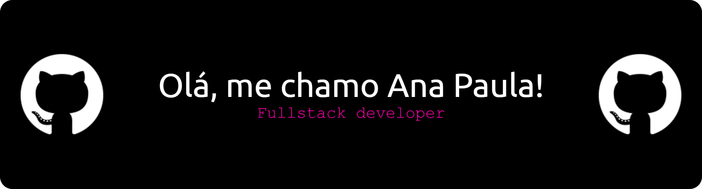

  

  ## Sobre mim

- 🤔 Curiosa em aprender sobre novas tecnologias do momento.
- 🎓 Formada em técnico em Informática para Internet e cursando Engenharia de Software.
- 💼 Trabalhando como Engenheira de Software I como fullstack.

## Minhas Skills

<code><code>

## Contatos:

  

  

